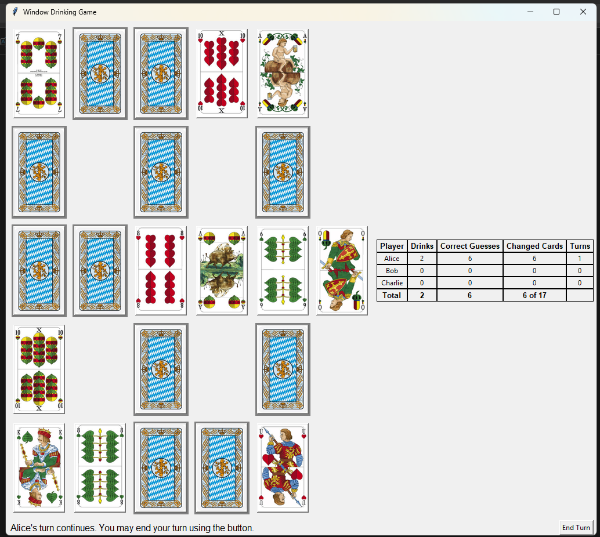
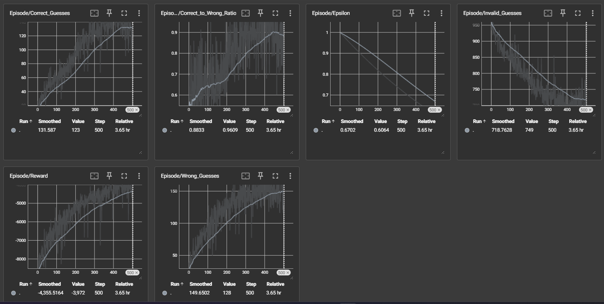
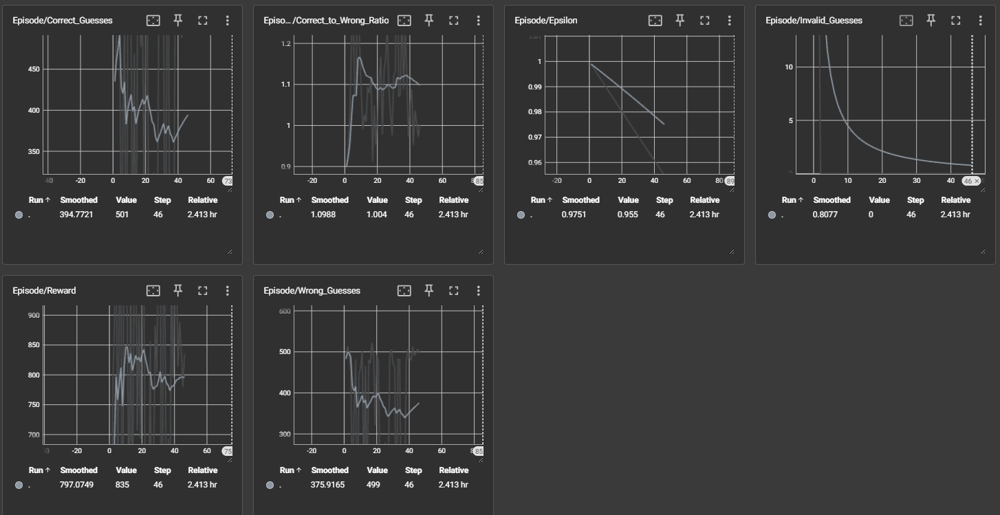

# Window - a German drinking game

This project's purpose is the:
- Development of the basic functionality of the German "Window" drinking game
- The creation and training of a DRL-Agend for the prediction of the next best move

## Table of Contents
- [Game Explanation](#game-explanation)
   - [Gameplay](#gameplay)
   - [Winning Condition](#winning-condition)
   - [Additional Notes](#additional-notes)
- [Development Documentation](#development-documentation)
   - [Architecture](#architecture)
   - [Agent/ Training](#agent-training)

## Game Explanation

### Setup
- The cards used are from a German deck (order: 6 < 7 < 8 < 9 < 10 < U < O < K < A) with four suits (Eichel, Blatt, Herz, Schelle)
- Arrange the cards in a “window” formation: all **corner** cards and the **handle** card are face-up; all others face-down.  
- The remaining cards form a face-down stack.  
- Typically, 3–8 players participate (but any number from 1 to 100 is also possible).

### Gameplay
1. **Initial/ Handle Rule**:
   - At the start of the game and whenever the handle is removed, the only valid move is to select the card adjacent to the handle. The player must guess if that face‑down card is higher, same, or lower than the handle’s rank.
2. **Guesses**:
   - If a face-down card is next to **one** (horizontally or vertically) face-up card, then the guess is either *higher*, *same* or *lower*
   - If a face-down card is **between two face-up cards**, the guess is whether its rank is *in between* or *outside* those two ranks (ties with boundary ranks count as *in between*).  
3. **Multiple Boundaries**:
   - If a face-down card touches more than one pair of face-up cards (e.g., horizontally and vertically), the player must choose **either** the horizontal **or** the vertical pair as the boundaries.  
   - “Around the corner” (mixing a horizontal card with a vertical card) is not allowed.  
4. **Correct Guess**:
   - The card is turned face-up.  
   - Special rule for 'same' guesses: If a player correctly guesses 'same', all other players must take one swallow.
   - The player may continue guessing another card or pass the turn.  
5. **Wrong Guess**:
   - The player drinks a number of times equal to the total number of cards removed.
   - The guessed card is removed along with every open card that is directly or indirectly adjoining it (i.e. if an open card touches an open card that is adjacent to the guessed card, it is also removed).
   - If the handle (the card at the handle position) is removed in this process, it is immediately redealt face-up and the next turn must be played on a card adjacent to the new handle.
   - All removed cards are shuffled back into the deck.
   - Missing spots are redealt: corners and handle are always redealt face-up, others face-down.
   - The same player takes the next turn.

### Winning Condition
- The game ends when **all cards** in the window are face-up.

### Additional Notes
- Only **ranks** matter (6–10, U, O, K, A); suits/colors are irrelevant.  
- “In between” includes matching the boundary ranks.
- If a face‑down card touches face‑up cards in more than one configuration (for example, one horizontal neighbor and two vertical neighbors), then if an in‑between option is available (i.e. from a pair of vertical or horizontal neighbors), it must be used. The player is not allowed to choose a higher/same/lower guess in such cases; they must make the in‑between/outside guess based on the available pair.
- “Around the corner” (mixing a horizontal card with a vertical card) is not allowed.

---
# Development Documentation

## Architecture
- core_game.py: Platform-independent game engine (shared logic)
- game.py: Desktop Tkinter UI (human gameplay)
- main.py: Desktop entry point (Tkinter app)
- mobile_bridge.py: JSON-friendly bridge for mobile clients
- simulation_env.py: Gymnasium wrapper around core_game.py for RL training/inference
- agent.py: Inference agent using a trained MaskablePPO model
- train.py: Config-driven training script using Gymnasium + MaskablePPO
- config.py: Definitions and configuration parameters for the game board/cards
- utils.py: Helper functions for the whole game
- configs/training_config.json: Training-specific configuration
- configs/simulation_config.json: Simulation/game configuration for training
- resources/additional/lookup_action_number_to_action.txt: Optional lookup reference (not runtime)

### Android Integration Path
1. Keep all game rules in `scripts/core_game.py` only.
2. Use `scripts/mobile_bridge.py` as the Android-facing API layer.
3. In Android, choose one of these integration approaches:
   - Embed Python with Chaquopy and call `MobileGameBridge` from Kotlin.
   - Run a small local Python service exposing bridge methods over HTTP/WebSocket and consume it from Compose.
4. Build the Android UI in Kotlin/Compose using state from `get_state()` and send user actions through `act(...)`.
5. Do not duplicate game rules in Kotlin; keep Kotlin as presentation + input only.

## Agent/ Training
1. By not sorting out all invalid actions, the model will do too many invalid actions and learning will be (too) slow:

    

 

2. For that nearly all invalid moves are multiplied by 0.0, so that the move will not be selected by the model. That increases the performance of the model. A test is made with a few episodes: 

    

 

3. The next development steps could include using previous board states as input (for this purpose the lstm-architecture was selected).

4. A further refinement of the reward function should also be considered.

## Setup Profiles
- Desktop game only:
  `pip install -r requirements/desktop.txt`
- Training / RL stack:
  `pip install -r requirements/train.txt`
- Mobile bridge backend only:
  `pip install -r requirements/mobile_bridge.txt`

The root `requirements.txt` points to the training profile for backward compatibility.

## Android Online Multiplayer
- The Android app supports offline play, creating an online room, and joining an online room.
- Online rooms use Firebase Anonymous Auth plus Firebase Realtime Database; players do not need Firebase or Google accounts.
- The host enters the full player list, creates a room code, and each phone joins with that code and its own player name.
- Only the phone whose local player name matches the current player can make moves; other phones observe the synced state.

### Firebase Setup
1. Create a Firebase project.
2. Add an Android app with package name `window_german_drinking_game.com`.
3. Enable Authentication -> Anonymous sign-in.
4. Create a Realtime Database.
5. Download `google-services.json` and place it at `android/app/google-services.json`.
6. Deploy `firebase-database.rules.json` to the Realtime Database rules.
7. Build/run the Android app from the `android` directory.

The Gradle Google Services plugin is applied only when `android/app/google-services.json` exists, so local builds without Firebase credentials still compile but online rooms will show a configuration error at runtime.
