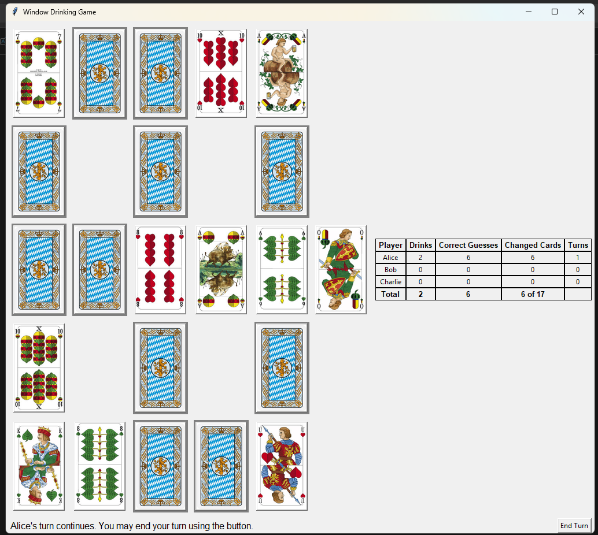

# Window - a German drinking game



This project's purpose is the:
- Development of the basic functionality of the German "Window" drinking game
- The creation of methods to predict the next best move, via
   - The training of a DRL-Agend
   - The development of a pure statistical method

**Window** is a cross-platform implementation of the German Window drinking
card game. Play locally on one device, host an online room for friends, or ask
the app for an advisory next-move proposal. The Flutter app runs on Windows,
Android, iOS, and the web.

> Play responsibly, use non-alcoholic alternatives whenever appropriate, and
> never pressure anyone to drink.

## What you can do

- Start an offline game with any non-empty list of player names.
- Create or join a Firebase-backed online room with a six-character code.
- Play the complete Window ruleset: handle moves, passes, redeals, and
  same-rank confirmations.
- Use **Propose best move** for an advisory model/heuristic suggestion. It
  never plays a move automatically.
- Train and deploy a replacement ONNX policy with the GPU-native RL pipeline.

## Play after cloning

Install the [Flutter SDK](https://docs.flutter.dev/get-started/install) and
the platform tooling for your target. Then run:

```bash
cd app
flutter pub get
flutter test
flutter run -d chrome
```

The last command starts a local browser game. Other common targets are
`windows`, a connected Android device/emulator, and (on macOS) `ios`:

```bash
flutter run -d windows
flutter run -d android
flutter run -d ios
```

Use `flutter build web` to create a browser release. The repository already
contains Windows, Android, iOS, and web Flutter targets; iOS requires macOS
and Xcode.

### Optional: online rooms

Local play needs no Firebase configuration. Online rooms require Firebase
Anonymous Authentication and Realtime Database in your own project. Create a
Git-ignored `firebase-options.json` in the repository root:

```json
{
  "FIREBASE_API_KEY": "...",
  "FIREBASE_WEB_API_KEY": "...",
  "FIREBASE_ANDROID_APP_ID": "...",
  "FIREBASE_WEB_APP_ID": "...",
  "FIREBASE_PROJECT_ID": "...",
  "FIREBASE_MESSAGING_SENDER_ID": "...",
  "FIREBASE_DATABASE_URL": "...",
  "FIREBASE_AUTH_DOMAIN": "..."
}
```

Deploy the supplied rules and start the app with that configuration:

```bash
npx firebase-tools deploy --only database --project YOUR_PROJECT_ID
cd app
flutter run -d chrome --dart-define-from-file=../firebase-options.json
```

The room creator is the trusted host: it validates moves and retains the deck
and face-down card identities. Guests receive the public board and submit
requests for their own seat. Keep the host app open during play.

## Documentation

- [Game rules](GAME_README.md) — setup, valid guesses, redeals, and scoring.
- [ML development](ML_README.md) — CUDA training, evaluation, export, and
  deployment.
- [ML agent specification](ml/ml_move_prediction_plan.txt) — target,
  information restrictions, contract, and acceptance criteria.

## Repository map

| Location | Purpose |
| --- | --- |
| `app/` | Flutter application for all player-facing platforms. |
| `app/lib/game_engine.dart` | Canonical rules, independent of UI and networking. |
| `app/lib/main.dart` | Responsive local and online game interface. |
| `app/lib/firebase_room_repository.dart` | Host-authoritative Firebase room transport. |
| `app/lib/rl_policy.dart` | ONNX inference, legal-action masking, and fallback suggestions. |
| `app/assets/` | Card artwork and bundled ONNX policy. |
| `app/test/` | Game-engine and policy-contract tests. |
| `ml/` | GPU-native masked-PPO trainer, simulator, and ONNX exporter. |
| `firebase-database.rules.json` | Firebase Realtime Database access rules. |
| `resources/docs/` | Documentation imagery. |

## Current model status

`app/assets/models/window_policy.onnx` is deliberately untrained and verifies
only packaging and inference. Until a trained policy is exported, the app
labels its proposal accordingly and uses a transparent heuristic fallback.
